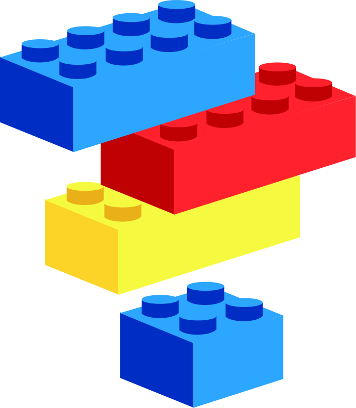

Up till this point, all elements that we have looked at have had specific structural or semantic purposes (i.e. defining a paragraph, heading, emphasized text, or including images). There are however, elements that provide structure, without necessarily implying styling or content.

The `
...
` element offers developers a **block-level element** to group other elements together. These elements work much like building blocks, in that they're separate bricks that come together to create the structure of the page.

This element is heavily used by developers to increase structural clarity and identify element groups. This in turn, increases readability, which is always desired.

This element also serves as an easy way to wrap content to style via CSS. _By itself, the sole styling implied by the_ `
` _element is that it will start on a new line._
