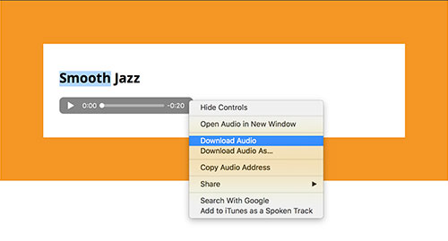

[The Audio Archive](https://archive.org/details/audio) is a great source of royalty-free and creative commons audio works, usually offered in MP3 format.

A personal favorite for music is through [Incompetech.com](https://incompetech.com/music/royalty-free/collections.php), which offers a ton of free-use (credit required) music and background audio.

Again, any audio you use should be your own or in "fair public use," usually under [Creative Commons](https://creativecommons.org/) (CC) public licence. **You should always credit the author when asked to do so.**

IMPORTANT: Test your pages on multiple computers and browsers to make sure the embedded media works.

### How-To Audio:

One of the potential issues of using the `<audio>` element in particular is that it allows end-users to easily download the audio file. For example, in Safari, this can be done by right-clicking the audio player and selecting "Download Audio." Chrome actually provides a download button with the audio player.

This ability is something to weigh when considering _content protection_, discussed at the end of this section.
