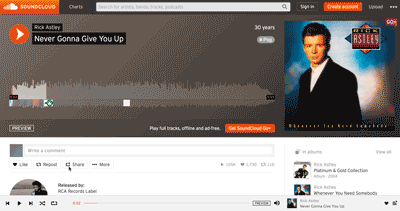

To embed third-party hosting, use their provided embed code, which often utilizes the `<iframe>` element.

The following is an example for [SoundCloud](https://soundcloud.com):

NOTE: Some services will limit the number of 'plays' that you can have for a certain period of time on the "free-tiers".
