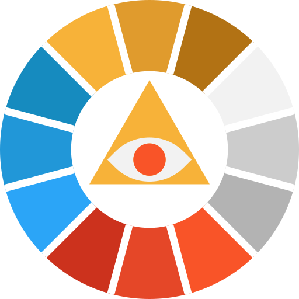

  

    

      

        

          
          <h4 class="list-group-item-heading">Duckett Ch 11: pgs 246-249</h4>
          

          
<i class="fa fa-clock-o" aria-hidden="true"></i> 3 minute reading

        

      

    

  

  

    

      

        <a href="https://htmlcolorcodes.com/color-names/" target="_blank" class="list-group-item">
          
          <h4 class="list-group-item-heading">Explore Common Name-RGB-Hexes</h4>
          

          
<i class="fa fa-clock-o" aria-hidden="true"></i> 3 minute activity

        </a>
      

    

  

  

    

      

        <a href="https://99designs.com/blog/tips/the-7-step-guide-to-understanding-color-theory/" target="_blank" class="list-group-item">
          
          <h4 class="list-group-item-heading">“Understanding Color Theory”</h4>
          

          
<i class="fa fa-clock-o" aria-hidden="true"></i> 10 minute reading

        </a>
      

    

  

  

    

      

        <a href="https://en.wikipedia.org/wiki/RGB_color_model" target="_blank" class="list-group-item">
          
          <h4 class="list-group-item-heading">Review RGB and Additive Color</h4>
          

          
<i class="fa fa-clock-o" aria-hidden="true"></i> 5 minute activity

        </a>
      

    

  

