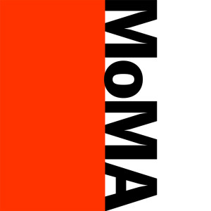
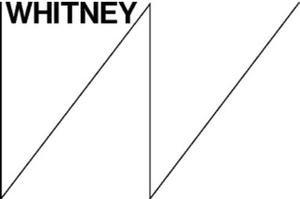

There are three general types of fonts that can be used in basic classification:

- 
serif

- 
sans-serif

- 
monospace

  <ul class="nav nav-tabs">
    <li class="active"><a href="#serif" data-toggle="tab">Serif</a></li>
    <li><a href="#sans-serif" data-toggle="tab">Sans-Serif</a></li>
    <li><a href="#monospace" data-toggle="tab">Monospace</a></li>
  </ul>

  

    

      <h3 style="font-family: serif; font-size:2em; margin-top: 0;">Serif Fonts</h3>
      
There are many examples of sites using "serif" fonts to great effect. Preview their usage on:

      <!-- Example Sites -->
      

        

          

            

              <a href="http://www.nytimes.com/2013/01/07/arts/design/what-constitutes-good-and-bad-web-design.html" target="_blank" class="list-group-item">
                
                <h4 class="list-group-item-heading">The New York Times</h4>
                

                
<i class="fa fa-link" aria-hidden="true"></i> Site Link

              </a>
            

          

        

        

          

            

              <a href="http://www.newyorker.com/culture/culture-desk/celebrating-design-without-contending-with-it" target="_blank" class="list-group-item">
                
                <h4 class="list-group-item-heading">The New Yorker</h4>
                

                
<i class="fa fa-link" aria-hidden="true"></i> Site Link

              </a>
            

          

        

        

          

            

              <a href="https://www.metmuseum.org/exhibitions/listings/2018/visitors-to-versailles" target="_blank" class="list-group-item">
                
                <h4 class="list-group-item-heading">The Met</h4>
                

                
<i class="fa fa-link" aria-hidden="true"></i> Site Link

              </a>
            

          

        

      

    

    

      <h3 style="font-family: sans-serif; font-size:2em; margin-top: 0;">Sans-Serif Fonts</h3>
      
Likewise, there are many examples of websites using sans-serif fonts to great effect:

      <!-- Example Sites -->
      

        

          

            

              <a href="https://www.moma.org/explore/inside_out/2010/02/19/a-few-words-with-yugo-nakamura/" target="_blank" class="list-group-item">
                
                <h4 class="list-group-item-heading">MoMA Blog</h4>
                

                
<i class="fa fa-link" aria-hidden="true"></i> Site Link

              </a>
            

          

        

        

          

            

              <a href="http://www.huffingtonpost.com/quora/-what-are-the-most-common_b_13772694.html" target="_blank" class="list-group-item">
                
                <h4 class="list-group-item-heading">HuffPost</h4>
                

                
<i class="fa fa-link" aria-hidden="true"></i> Site Link

              </a>
            

          

        

        

          

            

              <a href="https://whitney.org/About/History" target="_blank" class="list-group-item">
                
                <h4 class="list-group-item-heading">The Whitney</h4>
                

                
<i class="fa fa-link" aria-hidden="true"></i> Site Link

              </a>
            

          

        

      

    

    

      <h3 style="font-family: monospace; font-size:2em; margin-top: 0;">Monospace Fonts</h3>

      
Most modern fonts that are used for computers utilize "proportional width." This means a character is only as wide as necessary. Alternatively there is a class of fonts known as "fixed-width" or "monospaced." Each character in a monospaced font family is the same number of pixels wide.

      <!-- Example Sites -->
      

        

          

            

              <a href="http://www.klikerplatform.com/en/" target="_blank" class="list-group-item">
                
                <h4 class="list-group-item-heading">Kliker Dance</h4>
                

                
<i class="fa fa-link" aria-hidden="true"></i> Site Link

              </a>
            

          

        

        

          

            

              <a href="https://oak.is/about/" target="_blank" class="list-group-item">
                
                <h4 class="list-group-item-heading">Oak Designers</h4>
                

                
<i class="fa fa-link" aria-hidden="true"></i> Site Link

              </a>
            

          

        

        

          

            

              <a href="http://www.ninesixty.co.uk/" target="_blank" class="list-group-item">
                
                <h4 class="list-group-item-heading">Nine Sixty Design</h4>
                

                
<i class="fa fa-link" aria-hidden="true"></i> Site Link

              </a>
            

          

        

      

      
There has been a recent trend in using monospaced fonts, due to their legibility and implication of typewritten content. However, these fonts are primarily utilized for code. As an example, the code blocks throughout this courses webpages use the "Fira Mono" fixed-width font.

      
One of the primary reasons for using these fonts is that characters will align vertically between different lines:

      <pre>
        This line is 32 characters long.
        I also take up 32 characters ...

        We can have different phrases, :)
        But the characters will align. :)
        ------------------------------ :)
      </pre>

      
Since using a monospaced font essentially creates a grid system, many hackers (and any 90's teenager worth their salt) have utilized monospace fonts to create "ASCII Text Art."

      <pre>
         __               _    _
         \ \  _   _  ___ | |_ (_) _ __    ___
          \ \| | | |/ __|| __|| || '_ \  / _ \
       /\_/ /| |_| |\__ \| |_ | || | | ||  __/
       \___/  \__,_||___/ \__||_||_| |_| \___|
      </pre>

    

  

