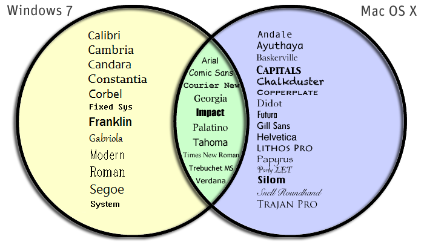

Licensing has a lot to do with how you'll select your fonts. In no way is every font available to every user - in fact, we're actually quite limited on what fonts platforms share:

In other words, "Calabri" will appear for Windows users accessing the site, but perhaps not for Mac users. The browser will then request a fallback or default font to render for those users, which may or may not look as the dev intended.

  <ul class="nav nav-tabs">
    <li class="active"><a href="#system" data-toggle="tab">System Fonts</a></li>
    <li><a href="#web" data-toggle="tab">Web Fonts</a></li>
    <li><a href="#safe" data-toggle="tab">Web-Safe Fonts</a></li>
  </ul>

  

    

      
System fonts are those already installed on your local device and system. These are available to you and most programs you use, but are not necessarily to the web (usually due to licensing).

      
You may have never second-guessed your use of system fonts, because you often select them with the intent to print. But most system fonts are not set up for the web, and should be limited to usage in logos and other branding. This is because they must be exported as <em>images</em>, affecting both assistive technologies and search engine indexing.

      

        
        
Font: “<a href="http://www.stereo-type.fr/fonts/bakery/" target="_blank">Bakery</a>”

      

      

        
        
Fonts: “<a href="https://fonts2u.com/fresh-marker.font" target="_blank">Fresh Marker</a>” and “<a href="https://www.whatfontis.com/Armageda-Wide.font" target="_blank">Armegeda Wide</a>”

      

      

        
        
Font: “<a href="http://fontpro.com/maybe-maybe-not-font-429" target="_blank">Maybe Maybe Not</a>”

      

      
NOTE: If you try to select one the fake brand names above, you'll see that your cursor grabs an image, and cannot highlight text (because there is none to do so). This is why text-images should be used sparingly.

    

    

      
Web fonts are custom fonts hosted on a server. They do not have to be available on the user's device to appear, but require certain elements to get called up correctly.

      
65% of websites currently use web fonts. These fonts are optimized for performing on the web, but are not full-proof. You should take into consideration browser compatibility, rendering speeds, and availability when selecting these fonts.

      
This site uses the web fonts:

        <ul>
          <li><a href="https://design.ubuntu.com/font/" target="_blank">Ubuntu</a></li>
          <li><a href="https://en.wikipedia.org/wiki/Menlo_(typeface)" target="_blank">Menlo</a> (with fallbacks)</li>
        </ul>
      
Common repositories for utilizing fonts in this way are <a href="https://fonts.google.com/" target="_blank">Google Fonts</a>, <a href="https://www.fontsquirrel.com/" target="_blank">Font Squirrel</a>, and <a href="https://typekit.com/" target="_blank">Adobe Typekit</a>.

    

    

    
Fonts that developers can count on being available by the system are known as "web-safe" fonts. These include font families that both Windows and Mac should have (see the graphic above).

    
Web-safe fonts include:

      <ul>
        <li style="font-family: Arial; font-size:1.25em;">Arial</li>
        <li style="font-family: Georgia; font-size:1.25em;">Georgia</li>
        <li style="font-family: Times; font-size:1.25em;">Times New Roman</li>
        <li>...as well as these other <a href="http://www.ampsoft.net/webdesign-l/WindowsMacFonts.html" target="_blank">web safe fonts</a></li>
      </ul>

      
The advantage of using fonts from this list is that the client computer will already have the font. This reduces load times and may increase performance.

    

  

