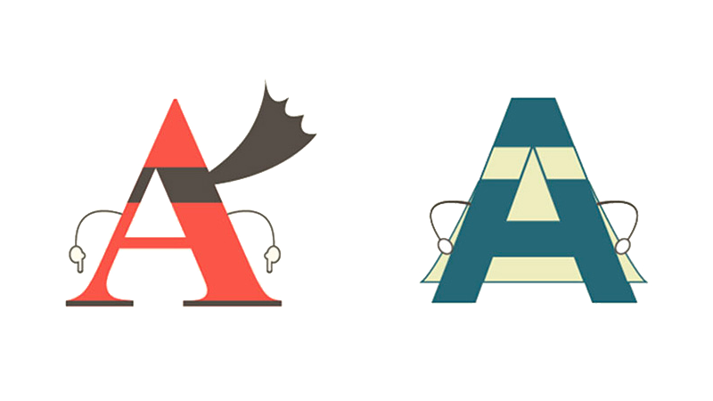
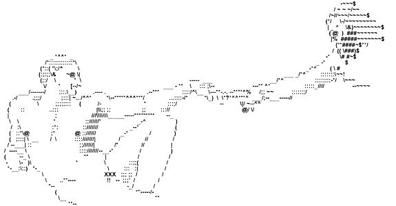

  

    

      

        

          
          <h4 class="list-group-item-heading">Duckett Ch 12: pgs 264-272</h4>
          

          
<i class="fa fa-clock-o" aria-hidden="true"></i> 7 minute reading

        

      

    

  

  

    

      

        <a href="../img/serif-vs-sans-infographic.jpg" target="_blank" class="list-group-item">
          
          <h4 class="list-group-item-heading">“Serif vs. Sans” The Final Battle</h4>
          

          
<i class="fa fa-clock-o" aria-hidden="true"></i> 6 minute reading

        </a>
      

    

  

  

    

      

        <a href="http://fontpair.co/" target="_blank" class="list-group-item">
          
          <h4 class="list-group-item-heading">Explore Popular Font Pairings</h4>
          

          
<i class="fa fa-clock-o" aria-hidden="true"></i> 4 minute activity

        </a>
      

    

  

  

    

      

        <a href="http://patorjk.com/software/taag/#p=display&f=Epic&t=Intro%0AWeb%20Dev%20%0A%26%20Design" target="_blank" class="list-group-item">
          
          <h4 class="list-group-item-heading">Make Some ASCII Art</h4>
          

          
<i class="fa fa-clock-o" aria-hidden="true"></i> 2 minute activity

        </a>
      

    

  

<!-- 

Also to help get us started this week, please read Cameron Chapman’s “A Crash Course in Typography” series, so that you have a solid fundamental understanding of typography.

  

    

      

        <a href="https://www.noupe.com/essentials/icons-fonts/a-crash-course-in-typography-the-basics-of-type.html" target="_blank" class="list-group-item">
          
          <h4 class="list-group-item-heading">Part 1: “The Basics of Type”</h4>
          

          
<i class="fa fa-clock-o" aria-hidden="true"></i> 13 minute reading

        </a>
      

    

  

  

    

      

        <a href="https://www.noupe.com/essentials/icons-fonts/a-crash-course-in-typography-principles-for-combining-typefaces.html" target="_blank" class="list-group-item">
          
          <h4 class="list-group-item-heading">Part 2: “Principles for Combining Typefaces”</h4>
          

          
<i class="fa fa-clock-o" aria-hidden="true"></i> 8 minute reading

        </a>
      

    

  

  

    

      

        <a href="https://www.noupe.com/essentials/icons-fonts/a-crash-course-in-typography-pulling-it-all-together.html" target="_blank" class="list-group-item">
          
          <h4 class="list-group-item-heading">Part 3: “Pulling It All Together”</h4>
          

          
<i class="fa fa-clock-o" aria-hidden="true"></i> 15 minute reading

        </a>
      

    

  

-->
