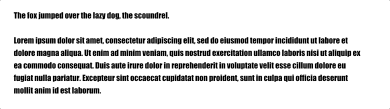
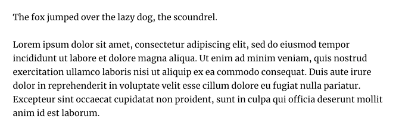

The font-family property should contain the primary font choice, which is then followed with a comma-delineated, list-of-fonts for the browser to _try_ and load should the primary choice fail for some reason. We consider these **fallback fonts**, in a **font stack**.

For example, the following will cause the browser to first try and load "Comic Sans MS". If the client computer (yours, in this case) does not have a font matching that name, it will then try "Comic Sans", then "Garamond", then "Times", then finally the your default 'serif' font.

The browser will do this by asking the client for the font. If the client doesn't have the font, then the browser will try the next listed font in the chain.

  

IMPORTANT: You should not choose fallback fonts carelessly. There are instances where primary fonts load slowly, and the next font in the stack takes its place while processing occurs. Having two unrelated fonts flash in can be jarring, and affect page layout.

See how poorly "Impact" references what will eventually be "Merriweather?"

"Georgia" is a much better fallback option (show here with additional character adjustments):

Visit [Font Style Matcher](https://meowni.ca/font-style-matcher/) to experiment with finding appropriate fallbacks!
