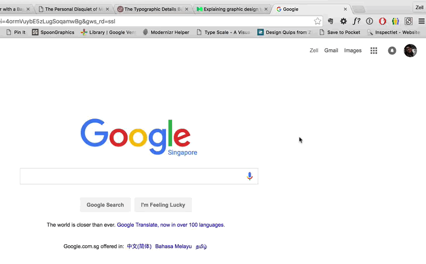

When deciding how to set the fonts of your page, remember that font size is an _inherited_ property. So, setting the font size for a parent element will cause it to be inherited by all child elements. When setting relative sizes, the parents must also utilize relative sizes, or they will override all other declarations.

  

## An argument for relative sizes:
The reason for using relative sizes is that everything in your page is then in relationship from the top (`*`) element or wherever you set your font size. If you are using ems, and then decide that everything is too small/large, you simply need to change the base element's size and everything else will also adjust.

In the following example, the `<html>` element is set to 120% its normal size. This has the effect of making all of the text on the page larger.

The `h1` and `h2` elements are set to be 0.5em and 2em, respectively, in relation to the parent element. This allows them to stay in relation to their main elements font size. Essentially, all h1 elements will be half the font size, and all h2 elements will be double the font size.

On the other hand, the `h3` element has been set to an absolute value of 40px. Therefore it will not adjust in size when the containing parent element is changed. As you see in the example, whereas the h1 and h2 elements both remain in proportion to the paragraph size, the h3 elements are the exact same size in both div blocks.

Finally, the relative size of `parent-1` and `parent-2` have been set uniquely so as to demonstrate the ability of relative sizes to maintain their relationships.

  

NOTE: If you intend to use ems or %, you must set the base size for the elements you are using also in ems or %. The parents elements must also use these relative sizes, all the way up to the `html` selector.

This is particularly true for headings, which are typically set in relation to the base paragraph size. If you choose to overwrite the size of headings in a page, make sure you do so with relative sizes and not absolute sizes.

## User Zooming
An important thing to remember is that users have the ability to zoom in and out of your website. They can increase/decrease the font size, typically by going to **View > Zoom In/Zoom Out**. This has the effect of changing a browser/pages text size.

In addition, users on most modern computers and mobile devices may "pinch" and zoom. This does not change the text size, but instead just zooms in the whole page.

If you are coming from a print world, the amount of flexibility this offers your end-users may be unsettling. But it _is_ powerful for them, and something you should embrace as well. **Just be aware of this while working on web development!**

