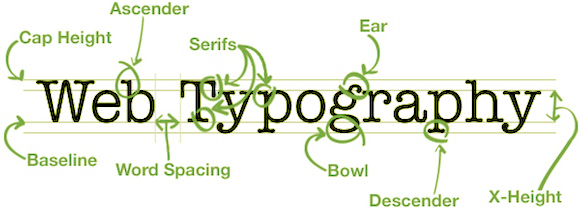

As with any text based rendering engine, it is also possible to adjust many additional properties of how the text is displayed.  We will examine a few of these over the next couple of sections, beginning here with options related to the _spacing_ of characters and words.
