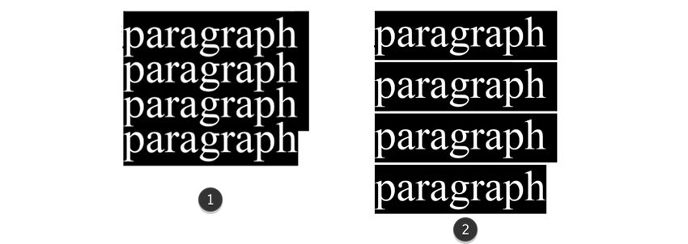

The first in question is known as **leading** (pronounced “ledding”) in typography. _Leading_ is the space between the top x-height of a font and the line of text above it.



We will refer to this more simply as _line-height_, as that is the css property which sets it (`line-height: `). The line hight property in CSS sets the vertical spacing between the lines of text.

<div id="code-heading">CSS</div>
```css
* {
  line-height: normal;
}
```

As with font size, you can set the line height through a number of units, including absolute and relative. If desired, one can set the line height as an absolute pixel (px) value. However, you are encouraged to use a number, percent, or ems.

`line-height:` accepts these term values:
- normal (default)
- pixels (`px`)
- points (`pt`)
- percent (`%`)
- ems (`em)`
- number (value multipled with font-size)
- ...most other size terms

<span class="label label-info">NOTE:</span> When you include a number, without any unit attached, the browser multiplies the current font size to set the line height. This is equivalent to calling a percentage or em. So, the following are all the same:

<div id="code-heading">CSS</div>
```css
* {
line-height: 2;
}
* {
line-height: 200%;
}
* {
line-height: 2em;
}
```


### “What is an appropriate line height?”
An appropriate line height, at its simplest, is one that encourages readability and understanding of the content.

However, in general, ideal leading ratios tend to be mentioned in the range of **1.2 - 1.45 times the text size**. This is typically larger than the size of a horizontal space between words, which encourages the eyes movement along the line, but not so large as to make text look separate from each other.

<div class="codepen-embed">
  <p data-height="600" data-theme-id="30567" data-slug-hash="NMGJgq" data-default-tab="css,result" data-user="Media-Ed-Online" data-embed-version="2" data-pen-title="[Topic-09] Line Height (Toggle)" class="codepen"></p>
</div>
