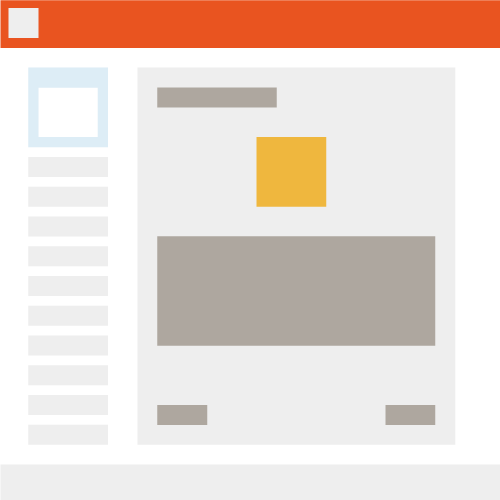

With CSS and HTML, you may think of elements as boxes. Webpages, therefore, are made up of boxes; inside boxes, next to boxes, inside more boxes. Boxes that kiss and hug, boxes that never touch, boxes that overlap, boxes that disappear...

The website you are looking at now is just a collection of organized boxes. You can see the header bar with inside boxes containing the site logo and navigation, the side menu with collapsible dropdown page links, a footer bar, and the largest "box" dedicated to page content like this one that you're currently reading. And each of these "boxes" are further broken down; for example, the header is made up of the logo, links, and icons to outside sources which are all pieced together by setting the placement of their "boxes" in the site's CSS.

It's important that you learn how to control the size, positioning, and placement of "boxes" on your _own_ sites, as this is the basics of creating layouts that both look good and function well.
