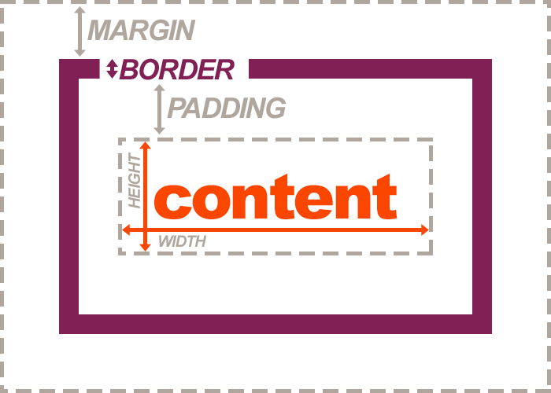

We can "draw" boxes with very minimal coding:

<div id="code-heading">CSS</div>
```css
.my-box {
  width: 100px;
  height: 50px;
}
```

This will give us an area to contain content (say color or text) 100px wide by 50px high, but little else. We cannot control placement, cushion, or relationship to other boxes without giving the stylesheet more information.

In HTML and CSS, we imagine elements as boxes with certain properties. Specifically, every block element in HTML has **padding**, a **border**, and **margin**. This is known as “The Box Model.”

We will go over the tricks and trades of the “box model” over this topic, as well as other techniques you can use to control the appearance of your content.
