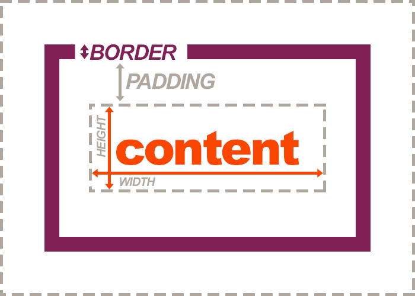

Looking back to our box model, we can see that the **margin** is the space between the box/element and _other_ elements, or the edge of the parent element.

As with padding, margin accepts both absolute and relative size units.

### Margin Shorthand Property
Margin also allows has a shorthand property. Likewise with padding, a single value will define all margins, or a trail of values can be used to set the top, right, bottom, and left margins in a single rule.

<div id="code-heading">CSS</div>
```css
/* ALL edges with have a margin of 1em: */
.my-box {
  margin: 1em;
}

/* The top AND bottom have a margin of 1em, the right AND left of 2em: */
.my-box {
  margin: 1em 2em;
}

/* Top, right, bottom, and left margin is manually set in that order: */
.my-box {
  margin: 1em 2em 3em 4em;
}
```


### Individual Margin Properties

You can also control the margin of individual edges by setting them individually:

<div id="code-heading">CSS</div>
```css
.my-box {
  margin-top: ;
  margin-right: ;
  margin-bottom: ;
  margin-left: ;
}
```
