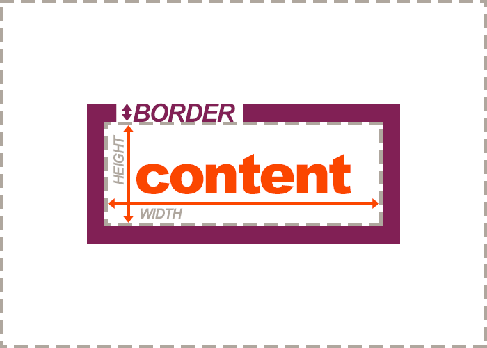

Another technique for changing the size of individual boxes (as well as controlling the relationships of elements to each other) is with the margin & padding CSS properties.

**Padding**, as seen in the image above, is the amount of space between the inner content of the element and the element itself (a border was included to help you see this).

### Padding Shorthand Property
As with borders, you can use shorthand to set the padding of an element. A single value will define all padding, or you can use some nifty trailing tricks to set all four cushions:

<div id="code-heading">CSS</div>
```css
/* ALL sides with have a padding of 1em: */
.my-box {
  padding: 1em;
}

/* The top AND bottom have a padding of 1em, the right AND left of 2em: */
.my-box {
  padding: 1em 2em;
}

/* Top, right, bottom, and left padding is manually set in that order: */
.my-box {
  padding: 1em 2em 3em 4em;
}
```


### Individual Border Properties

You can also control the padding of individual sides by setting them individually:

<div id="code-heading">CSS</div>
```css
.my-box {
  padding-top: ;
  padding-right: ;
  padding-bottom: ;
  padding-left: ;
}
```
